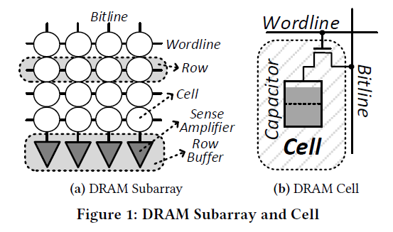
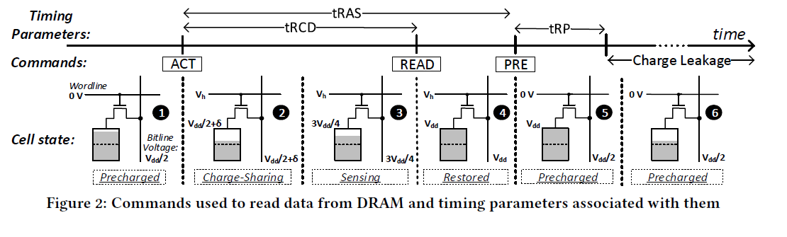

## ChargeCache: Reducing DRAM Latency by Exploiting Row Access Locality

### Introduction

- DRAM is commonly used because its nice trade-off between latency and cost. The cost has been optimized largely, while the latency of DRAM has not.

- Several major approaches to mitigate the long DRAM access latency:

  1. Employ large on-chip caches to exploit the temporal and spatial locality of memory accesses.

     However, cache capacity is limited by chip area.

  2. Employ aggressive prefetching techniques to preload data from memory before it is needed. 

     However, prefetching is ineffcient for many irregular access patterns
     and it increases the bandwidth requirements and interference in the memory system.

  3. Employ multithreading. 

     However, this approach increases contention in the memory system and does not aid single-thread performance.

  4. Exploit memory level parallelism.

     The benefits of these techniques are limited due to 1) address dependencies among instructions in the programs, and 2) resource conflicts in the memory subsystem.

- The latency of DRAM is heavily dependent on the design of the DRAM chip architecture, specifically the length of a wire called bit-line. Longer bit-lines result in higher DRAM access latency.

  Using shorter bit-lines may lead to much higher cost of the DRAM.

  

- Key observations:
  - Many applications tend to access rows that were recently closed (temporal locality). A DRAM row **remains in a highly-charged state** when accessed for the second time within a short interval after the prior access.
  - The amount of charge in DRAM cells determines the required latency for a DRAM access.

### How data is accessed in DRAM

- Common steps

1. The bit-line is precharged with $$\frac{V_{dd}}{2}$$, the word-line is lowered.
2. An ACT is sent to the corresponding row. It first raises the world-line so that the capacitor and bit-line are connected. The voltage level goes to $$\frac{V_{dd}}{2 } + \delta$$.
3. The sense amplifier is enabled and it detects the deviation on the bit-line.
4. The memory controller issues a READ or WRITE to access the data from the cell.
5. Restore the cell to its original state.

- If the cell is not accessed for a sufficiently long time, it may lose charge. Therefore, refresh of cells is required every *refresh interval*.
- Observations:
  - If the initial charge on the cell is low (as shown in state 6 ), then the perturbation caused by the cell on the bit-line voltage is also low. As a result, the sense amplifier takes longer to reach states 3 and 4. This is the case if the cell is accessed long after it is refreshed.
  - In fact, the values for tRCD and tRAS are determined based **on the worst case**, when the cell is accessed just before the end of its refresh interval, to guarantee correct operation of all cells.
  - However, cells closer to the fully-charged state **can be accessed with lower activation latency**.
- Recent work: when a row needs to be activated, the memory controller determines when the row was last refreshed. If the row was refreshed recently (e.g., within 8ms), the controller uses a lower tRCD and tRAS for the activation.
  - Only 12% of all memory accesses can be improved.
  - However, 86% of the memory accesses have temporal locality on rows.

### ChargeCache

- High-level design:
  - Add a small table to the memory controller that tracks the addresses of recently-accessed DRAM rows.
  - When a precharge command is issued to a bank, ChargeCache inserts the address of the row that was activated in the corresponding bank to the table.
  - when an activate command is issued, ChargeCache checks if the corresponding row address is present in the table. If so, it employs the reduced timing parameters; otherwise the standard ones.
  - ChargeCache invalidates entries from the table to ensure that rows corresponding to valid entries can indeed be accessed with lower access latency.
- Details:
  - Organize HCRAC (Highly-Charged Row Address Cache) as a set-associative structure similar to the processor caches.
  - When a new row address is inserted, ChargeCache may have to evict an already valid entry from the HCRAC. While it may result in wasted chances to reduce latency, evaluations show that even a small(128-entry) cache can provide significant improvement.
  - Use two counters to evaluate whether an entry needs to be invalidated.
  - On each ACT command, ChargeCache looks up the  corresponding row address in the HCRAC. If hit, the timing parameters are reduced.

### Evaluations

- Time performance:
  - Single core: 2.1% speed-up on average (up to 9.3%).
  - Eight cores: 8.6% speed-up on average.
- Energy:
  - Reduces energy consumption by up to 6.9% (14.1%) and on average 1.8% (7.9%) for single-core (eight-core) workloads.
- Temperature independence
- Applicability to other DRAM standards