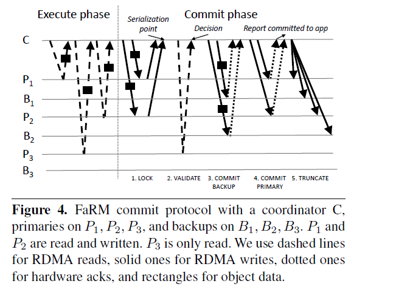

# FaRM: Distributed Transactions

### Introduction 

- Transactions provide an abstraction, but result in poor performance.
- FaRM: a main memory distributed computing platform.
- Two hardware trends in data centers:
  - Fast commodity networks with RDMA (remote direct memory access).
  - Providing non-volatile DRAM (**attaching batteries to power supply units and write data from DRAM to SSD when power fails**).
  - However, CPU bottleneck still exists.
- FaRM mitigate CPU bottlenecks by:
  - Reducing message counts;
  - Using one-sided RDMA reads and writes instead of messages (**no CPU participation** as a result);
  - Exploiting parallelism effectively.
- FaRM uses optimistic concurrency control with a four phase commit protocol (lock, validation, commit backup, commit primary).

### Programming Model and Architecture

- FaRM provides applications with the abstraction of **a global address space** that spans machines in a cluster.
- FaRM uses **optimistic concurrency control**. Updates are buffered locally and made visible to other transactions on a successful commit. Commits **may fail** due to conflicts with concurrent transactions or failures.
- FaRM guarantees that individual object reads are atomic, that they read only committed data, that successive reads of the same object return the same data, and that reads of objects written by the transaction return the latest value written.
- Uses ZooKeeper to ensure machines agree on the current configuration, but **not** relies on Zookeeper to manage leases, detect failures, or coordinate recovery.
- The CM(configuration manager) maintains a mapping from the region identifier to its primary and backups.
- The phase protocol:
  - Machines contact the CM to allocate a new region.
  - CM assigns a region identifier.
  - CM sends a prepare message to the selected replicas with the region identifier.
  - If all replicas success, the CM sends a commit message to all of them.

### Distributed Transactions and Replication

- FaRM uses primary-backup replication. In the execution phase, the coordinator **reads** information including the data and versions from the primaries.

- 

  - Lock: The coordinator writes a LOCK record on each machine that is a primary for any written object. The LOCK operation attempts to lock the objects at the specified versions. 

    LOCK may fail if any object version changed since if was read by the transaction or the object has been locked by others. If it fails, the coordinator returns error to the client and aborts the transaction.

  - Validate: The coordinator performs read validation by  reading, from their primaries, the versions of all objects that were **read but not written** by the transaction. If any objects has changed, validation fails.

  - Commit backups: The coordinator writes a COMMIT-BACKUP record to the non-volatile logs at each backup and then waits for an ack from the NIC hardware.

  - Commit primaries: After all commit backups are *ack*ed, the coordinator sends a COMMIT-PRIMARY to the logs to each primary. 

    Primaries process these records by updating the objects in place, incrementing the versions and unlocking them.