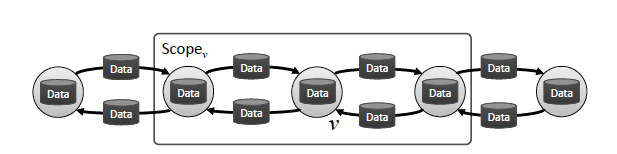
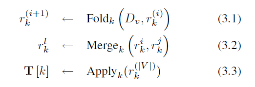

# Graph-Lab

### Introduction

- MapReduce widely used:
  - Efficient only when the algorithm is embarrassingly parallel and can be decomposed into a large number of **independent computations**.
  - Fails when there are **computational dependencies in the data**.

#### GraphLab Abstractions

- Data model
  - A **directed data graph** and a **shared data table**.
  - The data graph $G=(V,E)$   encodes both the problem specific sparse computational structure and directly modifiable program state.
  - Shared data table (SDT) is an associative map: $T[Key] \rightarrow Value$
- User defined computation
  - Update functions: local computation
    - A stateless function which operates on the data associated with small neighborhoods.
    - For every vertex $v$, we define $S_v$ as the neighborhood of $v$ which consists of $v$, its adjacent edges (both inbound and outbound) and its neighboring vertices.
    - Update functions also have the read-only access to the shared data table $T$.
    - The update function can be denoted as $D_{S_v} \leftarrow f(D_{S_v}, T)$:
  - Sync mechanism: global aggregation
    - The user provides a key $k$, a fold function (Eq. (3.1)), an apply function (Eq. (3.3)) as well as an initial value $r_k^{(0)}$  to the SDT and an optional merge function used to construct parallel tree reductions.
- Data consistency
  - Scopes may overlap, which leads to race-conditions resulting in data inconsistency and even corruption.
  - Consistency levels
    - Full consistency: No other functions will read or modify data **in the whole scope**.
    - Edge consistency: No other functions will read or modify data **in the edges or the vertex itself.**
    - Vertex consistency: No other functions will read or modify data **in the vertex itself**.

### Scheduling

Is used to describe the order in which update functions are applied.

