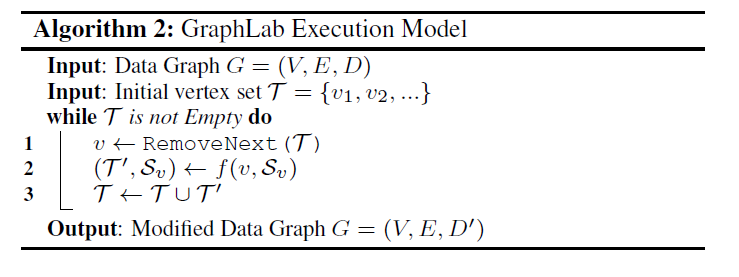

# Distributed GraphLab

#### Introduction

- A high-level abstraction that targets the **asynchronous, dynamic, graph-parallel** computation.
- MLDM (Machine learning and data mining) algorithm properties
  - **Graph structured computation**: dependencies between data
  - **Asynchronous iterative computations**: faster than synchronous ones, whose time is determined by the slowest process. Spark deals with iterative while still not asynchronous.
  - **Dynamic computation**: Often a large number of parameters converge quickly while the rest converge slowly. Therefore, we need to **update parameters not equally often**.
  - **Serializability**: to ensure correctness when concurrency is involved.

#### Designs

- Execution model

#### Distributed Designs

- Challenges
  - Balancing computation, communications and storage
- Solutions
  - The graph is first over-partitioned into $k$ parts,  where $k$ is much larger than the number of machines.
  - Each part is called **atom**, stored as a separate file on a distributed storage system.Each atom file is a simple binary compressed journal of graph generating commands such as `AddVertex(5000, vdata)` and `AddEdge(42 -> 314, edata)`.
  - Each atom stores information regarding **ghosts**: the set of vertices and edges adjacent to the partition boundary. Ghosts are caches for their true counterparts.
  - Versioning system is used to ensure cache coherence of the ghosts.
- Coloring
  - Each node has a color and no adjacent nodes share the same color.
  - Run the functions with the same color **to ensure edge consistency.**
  - Other consistency models can be achieved if the rule of coloring is changed.
- Distributed Locking
  - Different lock protocols to satisfy different types of consistency.