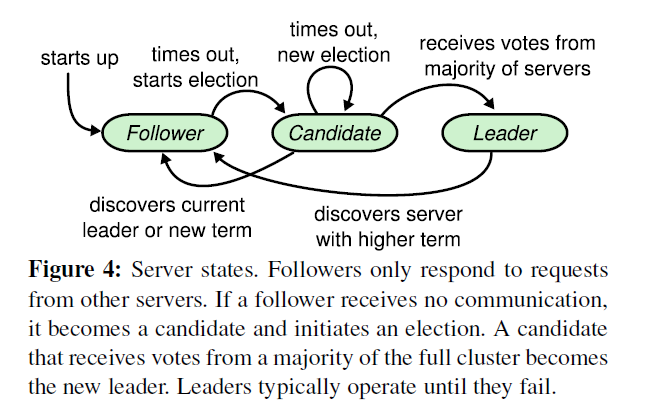

## In Search of an Understandable Consensus Algorithm (Raft)

### Introduction

- Paxos has dominated the discussion of consensus algorithms but it is hard to understand and it has to be changed to support practical systems.
- Novel Features:
  - Strong leader
  - Leader election
  - Membership changes

### Replicated State Machine

- Typically implemented using a replicated log. Each server stores a log containing a series of commands.
- Consensus algorithm's job: **keeping the log consistent**.
- Properties of consensus algorithms:
  - Ensure safety under non-Byzantine conditions.
  - Fully available as long as any majority of servers can communicate with each other and with clients.
  - Do not depend on timing to ensure the consistency (i.e. asynchronous)
  - A command completes as soon as a majority of cluster has responded.

### Paxos's Drawbacks

- Difficult to understand.
- Does not provide a good foundation for building practical implementations.
  - No widely agreed algorithm for multi-Paxos (details missing).
  - Not practical for building systems.
  - Uses a symmetric peer-to-peer approach (too complex)
- Raft:
  - Decomposition: divide the problem into several processes.
  - Simplify state space; making system more coherent and eliminating nondeterminism. 

### Raft

#### Philosophy

- Electing a distinguished **leader**, giving the leader complete responsibility for managing the replicated log.
  - The leader accepts log entries from clients, replicates them on other servers, and tells servers when it is safe to apply log entries to their state machines.
  - The leader can decide where to place new entries in the log without consulting other servers.
  - A leader mail fail or disconnect from others, in which case a new leader is elected.
- Raft is decomposed into three subproblems:
  - Leader election
  - Log replication
  - Safety

#### Details

##### Basics

- Three states:

  

  - Leader: handles all client requests
  - Follower: passive; issues no requests but only respond to requests from leaders and candidates; redirects client's request to the leader.
  - Candidate: during election

- Terms:

  - Each term begins with an election.
  - At most one (while zero is also possible) leader (who wins the election) in one term.
  - Acts as a logical clock in Raft.
  - Exchange of terms:
    - If one server’s current term is smaller than the other’s, then it updates its current term to the larger value.
    - If a candidate or leader discovers that its term is out of date, it immediately reverts to follower state.
    - If a server receives a request with a stale term number, it rejects the request.

- RPC methods:

  - Append-Entries RPC
  - Request-Vote RPC

##### Details

- Leader election:
  - Detection:
    - Leaders send heartbeats to all followers to maintain the authority.
    - If a follower receives no communications over a period of time, then it begins an election.
    - The follower **increments its current term**, **transitions to candidate state**, votes for itself and issues *Request-Vote RPC*s to all of others.
  - Process:
    - A candidate wins an election if it receives votes from a majority of the servers **for the same term**. Each server will **vote for at most one** candidate in a given term, following first-come-first-served.
    - If a candidate receives an Append-Entries RPC from another server claiming to be the leader, it accepts and transitions to be a follower if the caller's term is not smaller than its own; otherwise rejects.
    - If timeout and no one wins the election (votes split), the candidate increments its current term and starts another election. To avoid endless loop, Raft use **randomized election timeouts**.

- Log replication
  - When receiving requests from clients, the leader appends the command to its log, and issues Append-Entries RPCs to all others servers. If followers crash or run slowly, or the network packet is lost, the leader retries indefinitely until all followers store all log entries.
  - A log entry in committed once the leader has replicated it on a majority of the machines. The commit also **includes all preceding entries** in the leader's log. 
  - Log Matching Property:
    - • If two entries in different logs have the same index and term, then they store the same command.
    -  If two entries in different logs have the same index and term, then the logs are identical in all preceding entries.