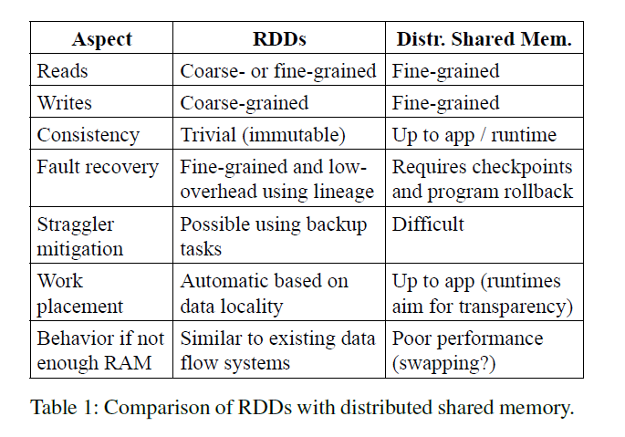
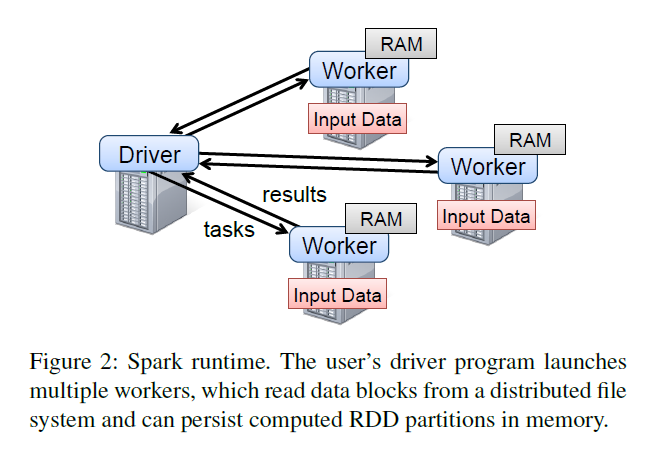

# Spark

*Resilient Distributed Datasets: A Fault-Tolerant Abstraction for In-Memory Cluster Computing*

### Introduction

##### Motivations

- Motivated by
  - Iterative algorithms 
  - Interactive data mining tools
  - (which are both inefficient in current computing frameworks)
- Current frameworks (MapReduce, etc.) failed to provide abstractions for leveraging distributed memory.
  - Inefficient for programs that reuse intermediate results across multiple computations.
  - **Data reuse** is common in graph algorithms and machine learning algorithms (PageRank, K-means and logistic regression, etc.).

##### Achivements

- Resilient Distributed Datasets (RDDs): A distributed memory abstraction that lets programmers perform in-memory computations on large clusters in a fault-tolerant manner.
- The main challenge: Defining an interface which provides fault tolerance efficiently.
  - Existing designs offer **fine-grained** (cell in a table) interface. Therefore, copying of a large amount of data through network is required.
  - RDDs provide an interface based on **coarse-grained** transformations (map, filter and join), and allows fault tolerance by logging.
- RDDs are a good fit for many parallel applications, because these applications naturally apply the same operation to multiple data items.
- 20x faster than Hadoop for iterative programs.

### Resilient Distributed Datasets (RDDs)

##### RDD abstraction

- An RDD is a read-only, partitioned collection of records.
- RDDs can only on 1) data in stable storage of 2) other RDDs.
- An RDD does not need to be materialized at all times. Use logs to compute how it derives from other datasets.

##### Spark programming interface

- Programmers' steps
  - Define one or more RDDs through transformations on data in stable storage (using *map* or *filter*).
  - Then use these RDDs in actions (*count, collect, save*, etc.)

- Benefits

  

  - Lineage: No overhead of checkpointing. Only the lost partitions of and RDD need to be recomputed upon failure, and they can be recomputed in parallel on different nodes, **without having to rollback the whole program**.

- Limitations of RDDs

  - Better for programs that do batch analytics.
  - Not suitable for an incremental web crawler, etc.

### Spark Programming Interface

- The driver defines one or more RDDs and invokes actions on them. Spark code on the driver also tracks the RDDs’ lineage. The workers are long-lived processes that can store RDD partitions in RAM across operations.

### Implementation

##### Job Scheduling

- It takes into account which partitions of the persistent RDDs are available in memory.
- Our scheduler assigns tasks to machines based on data locality using delay scheduling. If a task needs to process a partition that is available in memory on a node, we send it to that node. Otherwise, if a task processes a partition for which the containing RDD provides preferred locations (e.g., an HDFS file), we send it to those.

##### Memory Management

- Three ways to store persistent RDDs
  - In-memory as Java objects: fastest
  - In-memory as serialized data: slower but memory-efficient when space is limited.
  - On-disk: slowest. Only for data to large to be kept in memory.
- LRU to evict least recently used RDDs. **(Whether just delete them or store them on the disk???)**

