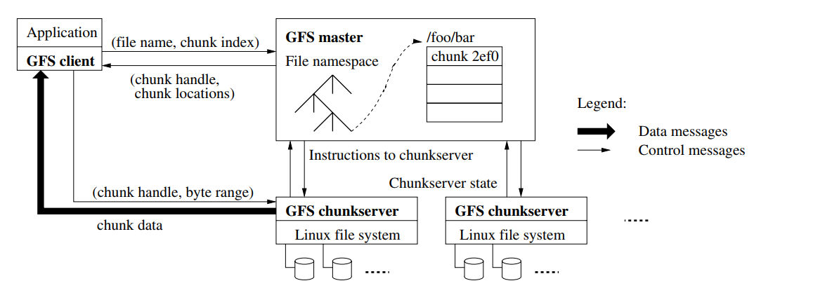
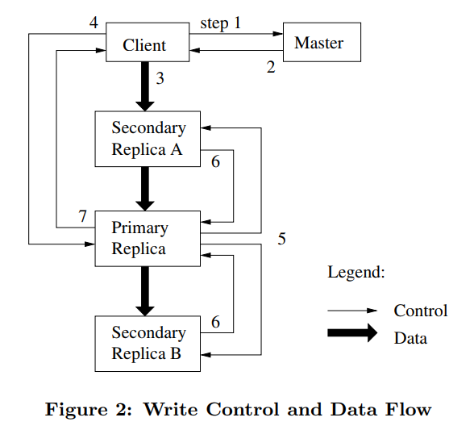

# The Google File System

### Keywords

- Distributed file system for large distributed applications
- Fault tolerance

### Introduction

- Failures are norm rather than exception.
- Files are huge
  - Revisit I/O and block size
- Appending new data is more likely to happen than rewriting existing ones.
- Co-design the applications and the API of file systems.

### Assumptions

- Files are large.
- Failures are common.
- Read operations often involve 1MB or more.
- Large & sequential writes (append) are often.
- Files may be accessed by multiple applications concurrently.
- Bandwidth is more important than latency.

### Architecture

- A single *master*, multiple *chunk servers* and multiple *clients*.
- Files are divided into *chunks*. *Chunks* and replicated on multiple *chunk servers*.
- *Master* connects with each *chunk server* via heart beat. *Master* stores metadata.
- 

- *Clients* **do not** read data from *master* to avoid *master* becoming the bottleneck of the system.

- Chunk size is 64 MB, each is stored as a **usual Linux file** (block size not changed). Such large size allows that:

  - Clients’ need to interact with the master are reduced because reads and writes on the same chunk require only one initial request to the master for chunk location information.
    - That operations on files are sequentially makes the case frequent.
    - Clients may cache chunk location.
  - Network overhead is reduced by keeping a **persistent** TCP connection to the chunk server.
  - The size of metadata stored on the *master* is reduced.

  Also there are disadvantages...

  - If many clients are accessing the same file, one chunk server may become the hot spot.

- Metadata includes 1) the file and chunk namespaces; 2)the mapping from files to chunks; 3) locations of each chunk's replicas.

  The first two types are both kept persistent by logging and also in memory. The locations are updated via communications between the master and chunk servers. 

  - When a chunk joins, it sends the information about what chunks it has.

### Consistency

- A file region is consistent if all clients will always see the same data, regardless of which replicas they read from. 
- A region is defined after a file data mutation if it is consistent and clients will see what the mutation writes in its entirety.
- States of a file region after a mutation
  - Consistent
    - All clients see the same data, regardless which replicas they read from
  - Defined
    - consistent + all clients see what the mutation writes in its entirety
  - Undefined
    - consistent +but it may not reflect what any one mutation has written
  - Inconsistent
    - Clients see different data at different times
    - The client retries the operation
- After a sequence of successful mutations, the mutated file region is guaranteed to be *defined* and contain the data written by the last mutation. 
  - By applying mutations to a chunk in the same order on all its replicas.
  - By using chunk version numbers to detect any replica that has become stale because it has missed mutations while its chunk server was down.

### System Interactions

- The master grants a chunk lease to one of the replicas,which we call the *primary*.

  The primary picks a serial order for all mutations to the chunk. All replicas follow this        order when applying mutations.

  The lease expires after a timeout of 60s. The master may also revoke the lease.

- 

  The replicas cache the data from the client and wait for the serial designated by the primary.

  Data is pushed linearly to avoid bottleneck in networks.

- Pipeline the data transfer over TCP connections.

- **Copy-on-write** technique is used in snapshot.

### Master Operation

#### Namespace Management and Locking

- GFS **does not have a per-directory data structure** to store the metadata.
- A set of locks are acquired before the master runs. If it involves `/d1/d2/.../dn/leaf`, it will acquire read-locks on `/d1`, `/d1/d2` and either a write or a read lock on the leaf.
- Advantages: Multiple operations may be run concurrently.

#### Replica Placement, Creation, Re-replication, Rebalancing

- We want to place new replicas on chunk servers with below-average disk space utilization.
- We want to limit the number of “recent” creations on each chunk server.
- We want to spread replicas of a chunk across racks.

- The master re-replicates a chunk as soon as the number of available replicas falls below a user-specified goal. (when some machines fail, etc.)
- Priority is evaluated when there are several chunks to be re-replicated.

- Finally, the master rebalances replicas periodically.

#### Garbage Collection

- When a file is deleted,  it will be renamed to be a hidden name. After some time, the system will scan the disk and reclaim the resource.
- The deleted file can be undeleted before the system reclaims the resource by renaming it with a usual name.

